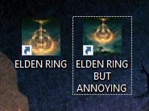
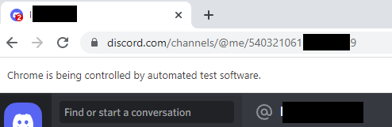

# Discord Automation
####
- An automated program to login and send messages to Discord using **_Selenium_**

- This program sends one message (written in main.py) to your Discord friend specified on lines 3 and 4 of **_account.txt_**. See **_sample_account.txt_**.

- The sample batch file will inform your co-op partner when you boot up Elden Ring 

## How to use
- install **_Selenium_**: python -m pip install selenium

- Create a text file in the same directory named **_account.txt_** to store your Discord email and password, and information about your friend's chat

- First line is your email/username and second line is your password

- Third and forth lines are the web address of your friend's chat (format:"https://discord.com/channels/@me/999999999999999999"), and their @username (include '@' symbol)

-- To find your friend's chat web address, login to the Discord web client and navgiate to their chat. Copy and paste the url in your browser search bar into **_account.txt_** on line 3.
 

- Make sure to install appropriate version of **_ChromeDriver_**, included version is compatiable with chrome version 115 (updated 2023-08-10)
https://chromedriver.chromium.org/downloads

- Run **_main.py_**, or use the included batch file / desktop short cuts to also start Elden Ring (if purchased through steam). If using the batch file, edit the first line to match the local directory where you've cloned this repo.

